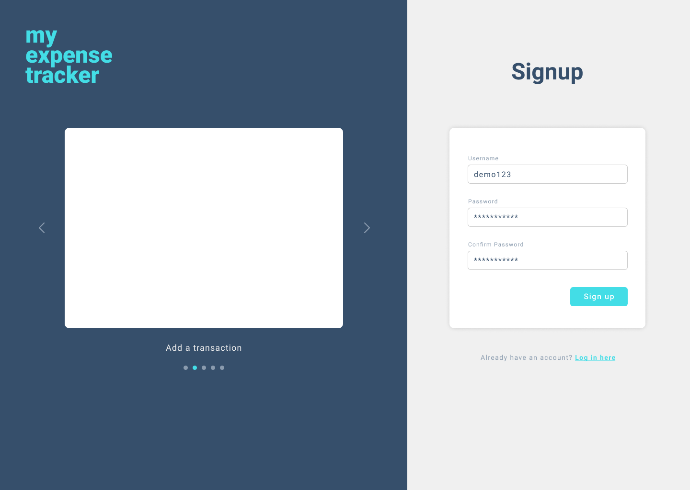
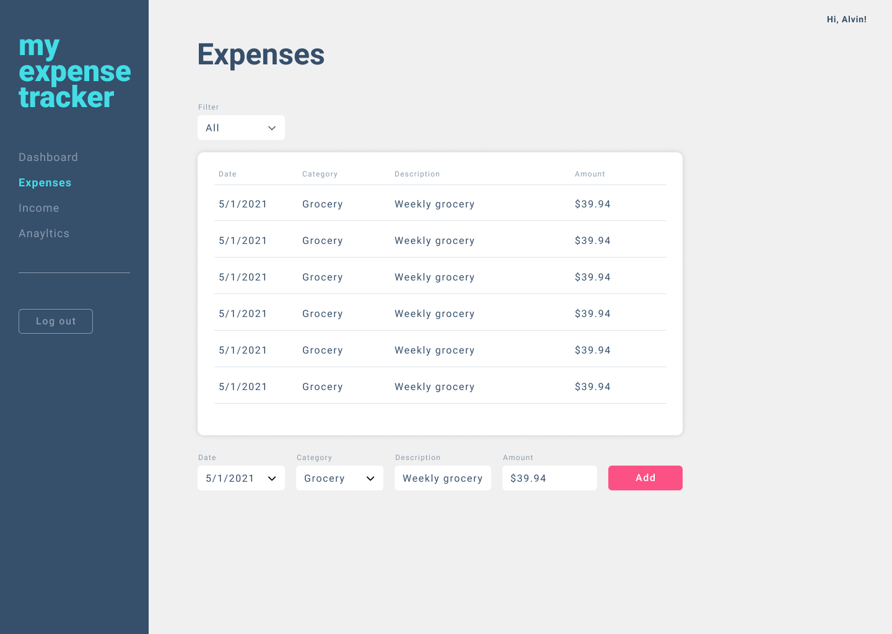

# My Expense Tracker
> A web application that allows users to keep track of their spending.

With this application, a user can track his or her expenses to see where his or her money is going. It also includes charts and graphs to easily visualize the spending.

## User Stories

```
AS A budget conscious individual
I WANT to keep track of my spending
SO THAT I can better manage my money in one place
```

## Acceptance Criteria
```
GIVEN the application
WHEN I arrive on the Expenses page
THEN I am presented with a table of expenses I've added
AND I am able to add a new expense
```

## Mockups
  


